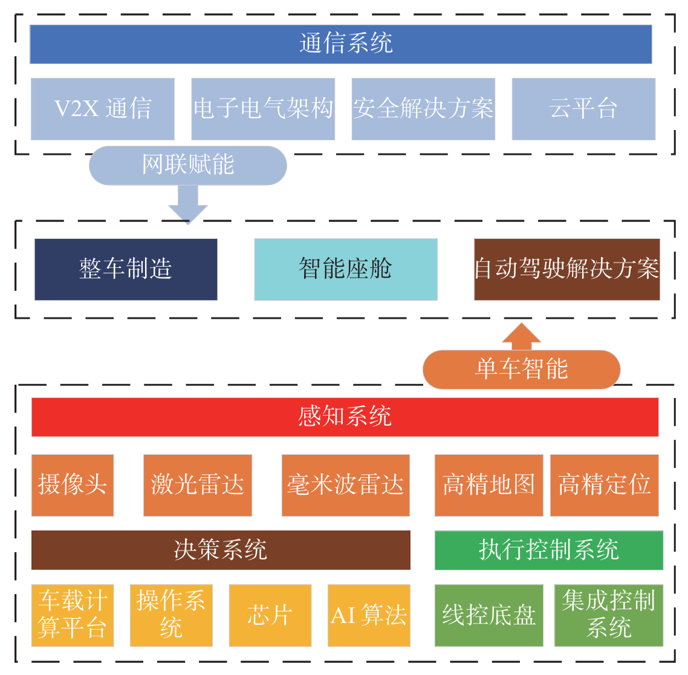
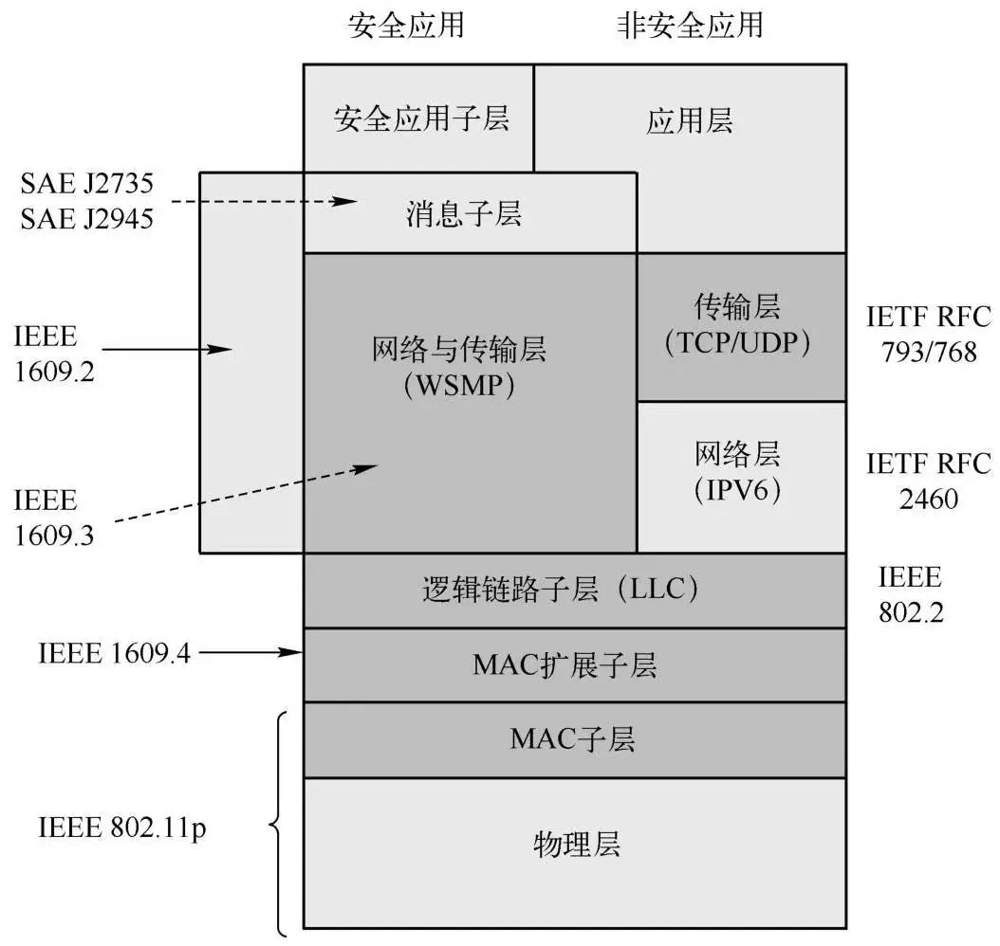
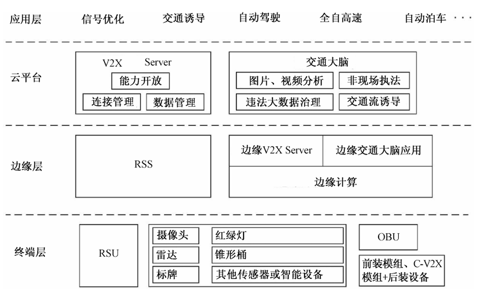

<h1 align = "center">基于车联网的智能网联汽车技术与应用研究</h1>

<h4 align = "center">学号：2120250723      姓名：于成俊</h4>

## 摘要

随着智能交通与车联网技术的快速发展，智能网联汽车（Intelligent and Connected Vehicle, ICV）逐渐成为提升道路交通安全、优化出行效率和推动汽车产业升级的重要方向。本文围绕基于车联网的智能网联汽车技术进行系统性分析，首先介绍了智能网联汽车的概念和应用价值，其次详细论述了环境感知、车身感知和网联感知三类关键感知系统技术，并分析了单车与车路协同感知的优势与局限。随后，本文对两类主流车联网通信技术——专用短程通信（DSRC）和蜂窝车联网（C-V2X）进行了架构、功能及应用分析，重点阐述了基于车路协同的 C-V2X 四层“端-边-云-用”体系结构及各层功能。最后，结合我国智能网联汽车的示范应用和产业政策进展，探讨了智能网联汽车的未来发展趋势，特别是应用推广、安全体系建设和法律法规完善等方向。本文旨在为学术研究和产业实践提供系统参考，并为智能网联汽车技术的推广应用与安全管理提供理论依据。

#### 关键词

智能网联汽车；环境感知；车身感知；网联感知；DSRC；C-V2X；车路协同；安全保障

## 一、引言

随着城市化进程的不断推进和机动车保有量的快速增长，交通拥堵、交通事故频发以及能源消耗增加等问题日益突出，已成为制约城市可持续发展的重要因素。传统交通系统和传统汽车主要依赖驾驶员的人工操作和经验判断，难以应对复杂多变的交通环境，其安全性和效率均存在较大提升空间。

近年来，物联网、云计算、大数据和人工智能等新一代信息技术的快速发展，为交通系统和汽车产业的智能化升级提供了重要契机。车联网作为物联网在交通领域的重要应用，通过实现车辆、道路基础设施、行人以及云平台之间的互联互通，使交通信息能够被实时感知、共享和利用。在此基础上发展起来的智能网联汽车，不仅具备环境感知和辅助驾驶能力，还能够通过网络实现协同决策与智能控制。

基于车联网的智能网联汽车技术已成为智能交通系统的重要组成部分，对提升道路交通安全水平、优化交通资源配置以及改善公众出行体验具有重要意义。本文以基于车联网的智能网联汽车为研究对象，结合物联网体系结构，从相关架构和关键技术层面展开分析，系统阐述其在城市智能交通中的应用模式，并对未来发展趋势进行展望。

## 二、 智能网联汽车概述

### 2.1 智能网联汽车的概念

智能网联汽车(intelligent and connected vehicle，ICV)是指通过集成先进的车载传感器、通信技术、控制系统和智能算法，实现车辆对自身状态和外部环境的感知、分析与决策，并通过车联网与其他交通参与者和云平台进行信息交互的新型汽车形态[<a href="#ref1" style="color:black; text-decoration:none;">1</a>]。智能网联汽车技术主要涵盖智能化与网联化两个方面。智能化侧重于车辆在不依赖外部通信信息的情况下实现自主驾驶能力，其发展水平由低到高依次包括辅助驾驶、部分自动驾驶直至完全自动驾驶5级。网联化则强调车辆基于通信与网络技术实现与外部环境的信息交互与协同，通过车与车、车与路以及车与云之间的通信提升整体交通系统的感知与决策能力，其发展阶段由低到高包括网联辅助信息交互、网联协同感知以及网联协同决策与控制三个层级[<a href="#ref1" style="color:black; text-decoration:none;">1</a>]。

### 2.2 智能网联汽车的应用价值

智能网联汽车是多学科交叉融合的产物，也是汽车产业转型升级的重要方向。与传统汽车相比，智能网联汽车突破了“单车智能”的局限，强调车辆之间以及车辆与交通基础设施之间的信息交互，从而使车辆能够获取更加全面的交通环境数据，提升整体交通系统的协同运作能力。借助车联网技术，智能网联汽车能够优化交通流、缓解拥堵，同时智能系统可提前感知潜在风险并主动干预，从而显著降低事故发生率。此外，智能网联汽车提供远程监控、车辆诊断、紧急救援等个性化服务，改善用户体验。在优化驾驶行为与交通流的过程中，还可有效降低能源消耗，带来明显的环境效益[<a href="#ref2" style="color:black; text-decoration:none;">2</a>]。总体来看，智能网联汽车是现代信息技术、人工智能技术与汽车产业深度融合的产物，如图2-1所示，其发展正在推动整个汽车行业发生深刻变革。

<figure style="text-align: center;">
  
  <figcaption>图 2-1 智能网联车产业链全景图[<a href="#ref2" style="color:black; text-decoration:none;">2</a>]</figcaption>
</figure>

## 三、智能网联汽车的感知系统关键技术

### 3.1 环境感知

环境感知是智能网联汽车实现自动驾驶的核心基础，它决定了车辆能否“看懂”周围环境并做出安全、合理的决策。环境感知的主要任务是从外界收集丰富的信息，包括附近的车辆、车道线、行人、建筑物、障碍物、交通标志以及信号灯等，从而为车辆的路径规划和控制提供数据支撑。

环境感知并不是单一传感器完成的，而是一个多传感器融合系统，主要包括四大类别的硬件传感器：车载摄像头、毫米波雷达、激光雷达、超声波雷达。

- 车载摄像头：主要用于捕捉环境的二维图像信息，能够识别车道线、交通标志、信号灯、行人以及其他车辆。现代功能强大的视觉传感器普遍内置视觉 SLAM 系统，仅通过摄像头即可同时实现定位与场景建图，从而实时获取环境信息[<a href="#ref3" style="color:black; text-decoration:none;">3</a>]。
- 毫米波雷达：是工作在30～300GHz频段，对应波长约为1～10mm的雷达，其通过天线向外发射毫米波，接收目标反射回波后，经信号处理器处理，可快速准确地获取汽车周围的环境信息，如车辆和障碍物的相对速度和相对距离[<a href="#ref4" style="color:black; text-decoration:none;">4</a>]。
- 激光雷达：通过发射激光束并测量反射时间生成高精度的三维点云，能够精确描述周围环境的空间结构，从而提供高精度距离和形状信息，并对复杂环境进行建模。
- 超声波雷达：主要用于短距离探测，例如泊车辅助或低速环境中的障碍物检测。其成本低、短距测量精度高，但探测距离有限，仅适合近距离障碍物检测。

通过融合不同类型传感器的数据，车辆能够在各种环境条件下实现可靠的感知能力。这种多模态融合策略能够弥补单一传感器的局限，例如雷达对形状不敏感的问题，可以通过摄像头提供的信息弥补；摄像头在低光照条件下识别困难，可以由雷达或激光雷达提供支撑。

在软件层面，环境感知还涉及识别车辆、人等交通参与者的行为意图，预测其未来轨迹。轨迹预测通常依赖于多种机器学习方法，包括滤波算法、长短期记忆网络（LSTM）[<a href="#ref5" style="color:black; text-decoration:none;">5</a>]以及深度置信网络（Deep Belief Network, DBN）[<a href="#ref6" style="color:black; text-decoration:none;">6</a>]等。Wu[<a href="#ref7" style="color:black; text-decoration:none;">7</a>]等人针对路侧行人穿行行为提出了一种融合动作识别与环境因素的意图识别与轨迹预测框架。具体而言，该方法首先利用LSTM对行人动作进行分类，如站立、行走或奔跑等；随后，将环境信息输入DBN中，对行人的穿行意图进行推断；最终，结合粒子滤波算法对行人的未来轨迹进行预测，以实现精确的轨迹预测。

总的来说，环境感知是智能网联汽车的“眼睛”，它通过多种传感器的实时数据采集和智能算法处理，使车辆能够感知和理解周围环境，为安全驾驶提供基础保障。

### 3.2 车身感知

车身感知是智能网联汽车自动驾驶系统中的核心模块之一，主要负责感知车辆自身状态，包括车辆位置、行驶速度、姿态方位等信息，为车辆决策与控制提供基础数据支持。与环境感知不同，车身感知关注的是“车在空间中的状态”而不是外部环境。

车身感知定位系统主要由惯性导航、卫星导航系统和高精度地图组成。 随着自动驾驶技术等级的提升，对地图的精度和实时性要求也越来越高。针对这一需求，欧盟 SAFESPOT [<a href="#ref8" style="color:black; text-decoration:none;">8</a>]项目提出了四层局部动态地图的概念：第一层为持续静态数据层，记录道路车道线位置、路口结构等长期不变的信息；第二层为瞬时静态数据层，包括交通标识、关键地标等短期变化较少的元素；第三层为瞬时动态数据层，用于反映信号灯相位、交通拥堵和道路管制等实时信息；第四层为高度动态数据层，关注交通参与者的位置、速度等即时动态信息。基于高精度地图，车辆用卫星导航系统进行定位，并用惯性导航提供的加速度与转角信息推算车辆位移[<a href="#ref9" style="color:black; text-decoration:none;">9</a>]。

### 3.3 网联感知

单一车辆感知主要依赖车辆自身的传感器，如摄像头、雷达等。这类感知方式虽然能够获取周围环境信息，但存在视野受限、感知距离有限、传感器盲区和环境条件干扰（如雨、雾、强光）等不足，容易导致车辆对复杂交通场景的认知不完整，从而影响安全性和决策的可靠性。

为弥补单车感知的局限，网联感知通过车与车（V2V）、车与基础设施（V2I）、车与网络（V2N）等通信技术实现信息共享和协同感知。车辆不仅可以获取自身传感器覆盖范围内的信息，还能实时获得周边车辆、交通设施甚至远端交通事件的数据，从而实现视野扩展和环境感知精度提升。网联感知能够提前感知潜在风险，辅助决策规划，提升整个交通系统的协同运行能力，同时为高等级自动驾驶提供必需的环境信息支持。

网联感知需要整合来自各方的数据，以构建更加全面、准确的环境模型。为此，Kim等人提出了一个可以将各车辆搭载的传感器信息想融合的框架，有效降低了单车感知盲区的影响[<a href="#ref10" style="color:black; text-decoration:none;">10</a>]。为了更好将数据融合，Chen[<a href="#ref11" style="color:black; text-decoration:none;">11</a>]等人使用神经网络对来自各个车辆的传感器数据进行特征提取和融合。

## 四、接入网络与车联网通信技术

接入网络是连接感知层与核心网络的重要桥梁，其性能直接影响智能网联汽车系统的信息交互效率和实时性。目前，车联网主要采用专用短程通信（DSRC）和蜂窝车联网（C-V2X）两种通信技术。

### 4.1专用短程通信（DSRC）

DSRC（Dedicated Short-Range Communications，专用短程通信）是智能交通系统（ITS）中核心的无线通信技术之一，承担着车辆与交通基础设施之间高速、低延迟信息交换的关键角色。它是一种短程、双向无线通信系统，专门用于车辆和道路设施的实时信息交互，支持车-车（V2V, Vehicle-to-Vehicle）和车-路（V2I, Vehicle-to-Infrastructure）通信，可以增强交通系统的安全性、效率和智能化水平。

DSRC 的协议栈采用分层设计，整体结构在传统无线通信体系的基础上，针对车联网高速移动、低时延和高可靠性的应用需求进行了专门扩展，如图4-1所示。其底层以 IEEE 802.11p 标准为核心，该标准是在 IEEE 802.11（Wi-Fi）基础上的增强版本，针对车载通信环境对信道带宽、调制方式和时延特性进行了优化，使车辆能够在高速行驶条件下实现稳定的无线接入。物理层和 MAC 层共同为 DSRC 提供了短时延、低开销的无线传输能力，是支撑车-车和车-路通信的基础。

在此之上，DSRC 引入了由 IEEE 1609 工作组制定的一系列 WAVE（Wireless Access in Vehicular Environments）标准，用于完善车联网场景下的网络功能。其中，IEEE 1609.4 负责多信道操作与信道切换机制，使系统能够在控制信道与业务信道之间高效切换，以同时满足安全消息和业务数据的传输需求；IEEE 1609.3 提供网络层及其相关服务，定义了包括 WAVE 短消息协议（WSMP）在内的通信机制，支持低时延的安全和控制信息广播；IEEE 1609.2 则专注于安全服务，涵盖身份认证、消息签名与加密等功能，保障车联网通信的可信性和数据完整性。

在高层协议方面，DSRC 兼容传统互联网协议体系，支持在网络层和传输层使用 IPv6 以及 UDP、TCP 等协议。这一设计使 DSRC 不仅能够满足实时安全应用对快速通信的要求，还能够支持车辆接入互联网，开展信息服务、远程管理等非实时业务。通过上述分层协议栈的协同工作，DSRC 实现了面向车联网应用的高效、可靠和安全的通信能力。

<figure style="text-align: center;">
  
  <figcaption>图 4-1 美国DSRC通信协议栈</figcaption>
</figure>

### 4.2蜂窝车联网（C-V2X）

C-V2X（Cellular Vehicle-to-Everything）是 3GPP 制定的全球统一标准，它是一种基于蜂窝移动通信技术发展而来的车载无线通信方案，包括设备间直接通信（D2D, Device-to-Device）和蜂窝网络进行信息传输，支持车辆与车辆（V2V）、车路协同（V2I）、车辆与行人（V2P）以及车辆与云端服务平台（V2N）等多种车联网应用场景的互联互通[<a href="#ref12" style="color:black; text-decoration:none;">12</a>]。

在 C-V2X 技术体系中，车辆与基础设施之间的通信主要通过 PC5 直连接口实现。为支持车路协同（V2I）应用，需要对车辆端和道路基础设施端进行相应的通信能力升级。在车辆侧，通常通过部署车载通信单元（On-Board Unit，OBU）以增强车辆的无线通信与信息处理能力；在道路侧，则需在路口、道路沿线等关键位置安装车联网路侧通信单元（Road Side Unit，RSU），用于采集、处理并转发交通相关信息。通过在车端和路端分别部署 OBU 与 RSU，车辆与基础设施之间即可基于 PC5 接口实现低时延、高可靠的直连通信，从而为 V2I 场景下的信息交互与协同控制提供基础支撑。

基于车路协同的C-V2X的体系架构总体沿用物联网的“端边云用”四层架构，从上到下依次为：应用层、云平台、边缘层和终端层，如图4-2所示[<a href="#ref13" style="color:black; text-decoration:none;">13</a>]。

<figure style="text-align: center;">
  
  <figcaption>图 4-2 基于车路协同的C-V2X体系架构[<a href="#ref13" style="color:black; text-decoration:none;">13</a>]</figcaption>
</figure>

终端层是信息采集与交互的基础，主要由智能网联车辆和智能化道路设施构成。车辆通过多种传感器获取周围环境和自身状态信息，并借助车载单元（OBU）实现 C-V2X 通信；道路侧则通过摄像头、雷达、智能信号灯等设施，并结合路侧单元（RSU），向车辆和管理部门提供交通与环境信息。

边缘层侧重于就近计算与快速响应，引入多接入边缘计算（MEC）以降低时延并减轻终端和网络负载。该层通过路侧服务器和边缘计算平台对多源感知数据进行融合分析，实现局部交通态势感知和风险预警，同时通过差分基准站为车辆提供高精度定位支持。

云平台负责全局数据的集中管理与深度分析，主要由 V2X Server 和交通大脑组成。云端对车路协同数据进行汇聚、路由与存储，并开展交通态势评估、策略生成和优化调度，从整体层面提升交通系统的安全性与运行效率。

应用层面向车主、行人和交通管理部门，提供具体业务与服务功能。依托端、边、云协同能力，该层可支持交通信号优化、交通诱导与管控，以及自动驾驶相关应用，充分发挥车路协同体系的实际价值。

## 五、智能网联汽车应用

早在 2023 年，我国已在多个地区推动智能网联汽车的示范应用落地，例如苏州“轻车熟路”车路协同自动驾驶系统以及成都基于全息路口的智能交通管理实践，标志着相关技术开始从试点验证走向实际应用。随后，产业政策层面也取得了关键进展。2025 年 12 月 15 日，中国汽车工业协会常务副会长兼秘书长付炳锋发文指出，工业和信息化部正式对长安牌和极狐牌两款 L3 级自动驾驶车型产品给予附条件准入许可。这一事件表明，我国自动驾驶产业正由“技术验证”阶段加速迈向“量产应用”阶段，智能网联汽车进入规模化落地的新时期。

从应用发展趋势来看，智能网联汽车的大范围普及已具备现实基础和明确路径。当前，ICV 应用将持续沿着由低等级向高等级自动驾驶演进，其应用场景也将从封闭或半封闭的特定环境逐步拓展至开放、复杂的城市道路以及跨区域交通网络。同时，ICV 的应用模式正由以单车智能为核心，向以车—路—云深度协同为特征的系统化应用转变。依托车路协同基础设施和云平台能力，未来交通系统有望实现更高效的运行调度和更优质的出行服务体验。与此同时，政府、科研机构与产业界之间的协同将进一步加强，通过示范工程推进、标准体系完善和产业生态共建，加快 ICV 技术在更大范围内的规模化部署。

在应用不断拓展的同时，安全问题将成为智能网联汽车发展的核心关注点。随着自动驾驶等级提升和系统复杂度增加，ICV 的安全内涵将由传统行车安全，进一步延伸至功能安全、预期功能安全、网络与数据安全以及系统级运行安全等多个层面。未来 ICV 系统需要构建覆盖全生命周期的网络与信息安全防护体系，以“检测—防护—响应—恢复”为核心框架，针对不同风险等级制定分级处置和恢复策略。在技术层面，有必要积极引入和推广隐私计算、同态加密、联邦学习等前沿方法，以降低数据流通和模型训练过程中的隐私泄露风险，同时结合区块链、数字水印等技术增强数据的防篡改性和可追溯性，从而提升系统整体的可信度[<a href="#ref14" style="color:black; text-decoration:none;">14</a>]。此外，车路协同作为智能网联汽车的重要发展方向，应进一步完善和优化 V2X 通信技术，实现车—车、车—路、车—人及车—网之间的高可靠、低时延交互，为交通安全和自动驾驶功能提供稳定支撑[<a href="#ref15" style="color:black; text-decoration:none;">15</a>]。在车载系统层面，还需重点提升车内操作系统及中间件的安全性和可维护性，针对当前广泛应用的 Linux 和 Android 平台进行针对性加固，以更好地支撑多样化车载应用和服务[<a href="#ref16" style="color:black; text-decoration:none;">16</a>]。

与此同时，基于虚拟化技术构建仿真测试环境，也是提升安全保障能力的重要手段。通过在虚拟环境中模拟复杂的车辆电子电气架构和真实攻击场景，可以在降低研发成本的同时，系统性评估安全防护措施的有效性。技术进步还需与法律法规和伦理规范同步推进。随着智能网联汽车逐步融入社会运行体系，亟需在责任认定、事故处理、数据使用等方面完善制度设计，并前瞻性评估其对社会结构和就业形态的潜在影响，从而为智能网联汽车的安全、可持续发展提供制度保障[<a href="#ref17" style="color:black; text-decoration:none;">17</a>]。

## 六、总结

本文系统分析了基于车联网的智能网联汽车技术，阐述了其通过智能化与网联化手段实现对车辆自身状态及周围环境的感知、分析与决策，从而优化交通流、降低事故风险并提升出行体验，同时在能源利用方面具有积极效益。文章进一步介绍了环境感知、车身感知与网联感知三类关键感知系统，分别通过多传感器融合、惯性导航与高精度地图以及车—车、车—路和车—网通信实现对环境和车辆状态的全面掌握。车联网通信技术方面，DSRC 与 C-V2X 构成智能网联汽车的核心通信手段，其中 C-V2X 借助 PC5 接口及“端-边-云-用”四层架构实现车路协同，提高交通系统的实时性与安全性。结合我国智能网联汽车的示范应用和政策进展，文章指出其未来将沿低等级向高等级自动驾驶演进，应用场景从封闭道路向城市及跨区域交通网络扩展。同时，随着系统复杂度提升，智能网联汽车的安全内涵逐步涵盖功能安全、网络与数据安全及系统级运行安全，未来的发展需依托全生命周期安全体系建设、技术创新、法规完善及车路协同与仿真测试等多方面保障，实现可持续发展。

## 参考文献

[1] 中华人民共和国工业和信息化部. 智能网联汽车技术路线图[R]. 北京: 工信部, 2016.

[2] 任奎, 杨坤, 沈浩頲等. 智能网联汽车网络信息安全综述[J]. 网络空间安全科学学报，2024,2(6): 16-35.

[3] 付智珍. 智能网联汽车环境感知技术研究[J]. 内燃机与配件,2023(13):116-118.

[4] 陈艳梅, 薛亮. 智能网联汽车环境感知技术揭秘[J]. 汽车与配件, 2022(17):59-63.

[5] S. Hochreiter,  J. Schmidhuber. Long Short-Term Memory. Neural Computation. vol.9, no.8, pp. 1735-1780, 15 Nov. 1997.

[6] Geoffrey E Hinton. Deep belief networks[J]. Scholarpedia,2009(4):5947.

[7] WU H R, WANG L K, ZHENG S F, et al. Crossing-road pedestrian trajectory prediction based on intention and behavior identification[C]//2020 IEEE 23rd International Conference on Intelligent Transportation Systems (ITSC). 

[8] Safespot. Cooperative vehicles and road infrastructure for road safety[EB/OL]. 2010.

[9] 崔明阳, 黄荷叶, 许庆等. 智能网联汽车架构、功能与应用关键技术. 清华大学学报(自然科学版), 2022, 62(3): 493-508.

[10] KIM S W, QIN B X, CHONG Z J, et al. Multivehicle cooperative driving using cooperative perception: Design and experimental validation[J]. IEEE Transactions on Intelligent Transportation Systems, 2015, 16(2): 663-680.

[11] CHEN X Z, MA H M, WAN J, et al. Multi-view 3D object detection network for autonomous driving[C]//2017 IEEE Conference on Computer Vision and Pattern Recognition (CVPR). Honolulu, USA: IEEE. 2017: 6526-6534.

[12] 毕以峰.电信云网络架构及对云网融合的要求[J].信息通信技术, 2019(2): 26-31.

[13] 姚美菱, 张星, 李莉等.基于车路协同的车联网体系架构及关键技术分析[J]. 电信快报,2021,(06):10-13.

[14] 岑洪婵, 黄志杰, 余嘉旎. 智能网联汽车测试与评价研 究[J]. 汽车测试报告, 2023(10): 47-49.

[15] 葛欣, 董建阔, 陈滏媛等. 智能网联汽车数据安全检测研究现状[J]. 现代交通与冶金材料.2023, 3(3): 30-42.

[16] 陈凯, 马宇辰, 杨晓航等. 智能网联汽车整车测试技术探讨[J]. 通信世界, 2024(3): 28-31.

[17] WANG J, SHAO Y, GE Y, et al. A survey of vehicle to every thing (V2X) testing[J]. Sensors, 2019, 19(2): 334.

